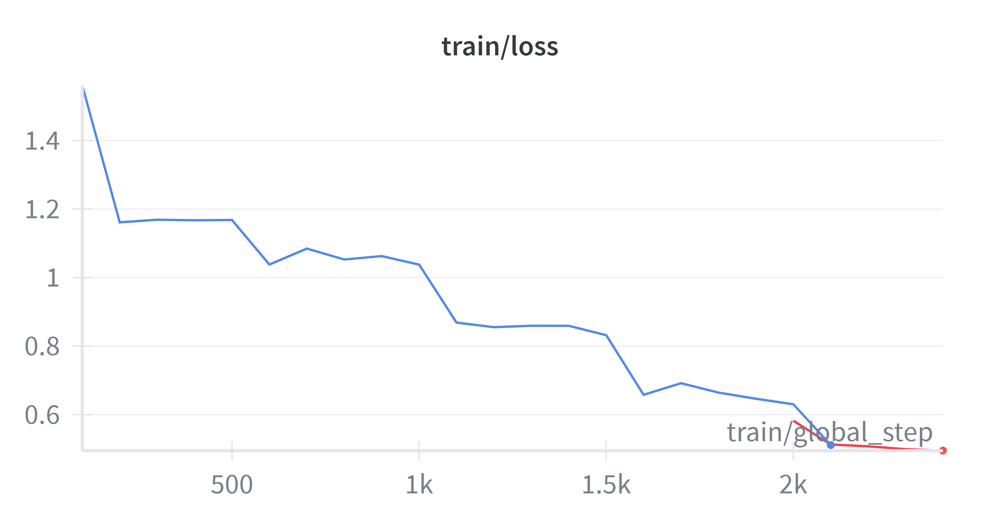

# Vision Radiology Agent

This project contains the documentation and result visualizations for a **LoRA-fine-tuned vision-language model** based on **Unsloth / Llama-3.2-11B-Vision-Instruct**, adapted for **radiology image captioning and reporting**.  
**Training code and raw datasets are not included** in this repository — only the README and result images (learning curves, example generations).

---

## Project overview

- **Goal:** Fine-tune a vision-capable LLM to produce accurate radiology descriptions and structured reports from medical images.  
- **Base model:** `unsloth/Llama-3.2-11B-Vision-Instruct` (Unsloth FastVisionModel)  
- **Fine-tuning technique:** LoRA adapters (PEFT), 4-bit quantization for memory efficiency  
- **Dataset used for fine-tuning:** `unsloth/Radiology_mini` (Hugging Face dataset)  
- **Training infra:** Google Colab (GPU), tracked with Weights & Biases (wandb)  
- **Repository contents:** only documentation and result images

---

## Pretrained / Published model

The fine-tuned, merged model has been pushed to the Hugging Face Hub:

🔗 **Hugging Face Model (inference-ready):**  
`https://huggingface.co/ali8461/Llama-3.2-11B-Vision-Radiology-mini`

---

## How to load & run the model (example)

Below is a minimal example showing how to load the merged model from Hugging Face and run inference. This example uses `transformers` for the merged model and assumes you have access to the repository (public or via token).

```python
from transformers import AutoTokenizer, AutoModelForCausalLM
import torch
from PIL import Image

model_name = "ali8461/Llama-3.2-11B-Vision-Radiology-mini"

# Load tokenizer & model (merged, inference-ready)
tokenizer = AutoTokenizer.from_pretrained(model_name)
model = AutoModelForCausalLM.from_pretrained(model_name, torch_dtype="auto")
model.eval().to("cuda")

# Example: prepare an image + prompt (image preprocessing depends on tokenizer/model)
image = Image.open("results/example_image_1.png")  # example image path
prompt = "You are an expert radiographer. Describe accurately what you see in this image.\n\n### Image:\n"

# NOTE: the exact image+text inputs / preprocessing depend on the model/tokenizer implementation.
# Use the Unsloth `FastVisionModel` utilities if available, or follow the model card instructions.
inputs = tokenizer(prompt, return_tensors="pt").to("cuda")
# If model expects image tensors, follow the model-specific API (e.g., FastVisionModel.from_pretrained).

outputs = model.generate(**inputs, max_new_tokens=256)
print(tokenizer.decode(outputs[0], skip_special_tokens=True))
````

---

## Training summary (not included)

* **Number of epochs:** 5
* **LoRA rank (r):** 16
* **Learning rate:** 5e-5
* **Batch size:** effectively small (vision models use batch size 1 with gradient accumulation)
* **Precision / quantization:** 4-bit for weights; mixed precision for training when supported (fp16 / bf16)
* **Checkpointing:** saved to Google Drive during training; final merged model pushed to HF hub

---

## Results

### 1) Learning curve (training loss / validation metrics)



---

### 2) Example before / after generations (visual + caption)


| Radiology Image                       | Model-generated Report                          |
| ------------------------------------- | ----------------------------------------------- |
|  |  |
|  |  |

---

## Evaluation & qualitative notes

* The model demonstrates improved **descriptive accuracy** and **clinical language fluency** compared to the base model after LoRA fine-tuning.
* **Limitations:** small fine-tuning dataset (`Radiology_mini`) → may not generalize to rare findings or modalities not present in the training set.

---

## Safety & clinical use disclaimer

**Important:** This model is intended for research and educational demonstration only. It **must not** be used as a standalone diagnostic tool or as a replacement for professional medical judgment.

* Always validate outputs against expert radiologist review.
* Never deploy without rigorous clinical validation, regulatory approvals, and continuous monitoring.

---

## Dependencies (used during training in Colab)

* Python ≥ 3.9
* PyTorch ≥ 2.0
* Unsloth (from GitHub)
* Transformers, Datasets, TRL, wandb, huggingface_hub
* Typical vision libs: Pillow, torchvision, accelerate (if used)

---

## Author

**Ali** — AI and Data Engineer

* Hugging Face: [https://huggingface.co/ali8461](https://huggingface.co/ali8461)
* GitHub: [https://github.com/ali8461](https://github.com/ali8461)

---

## License

MIT License
